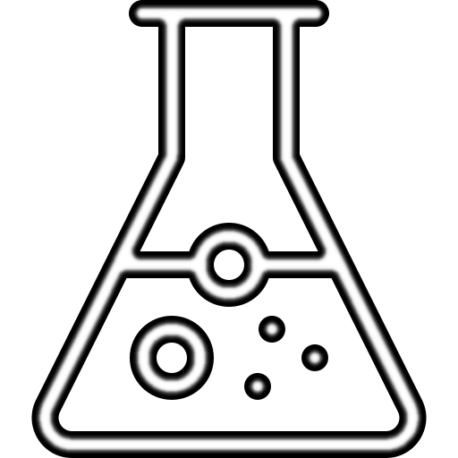
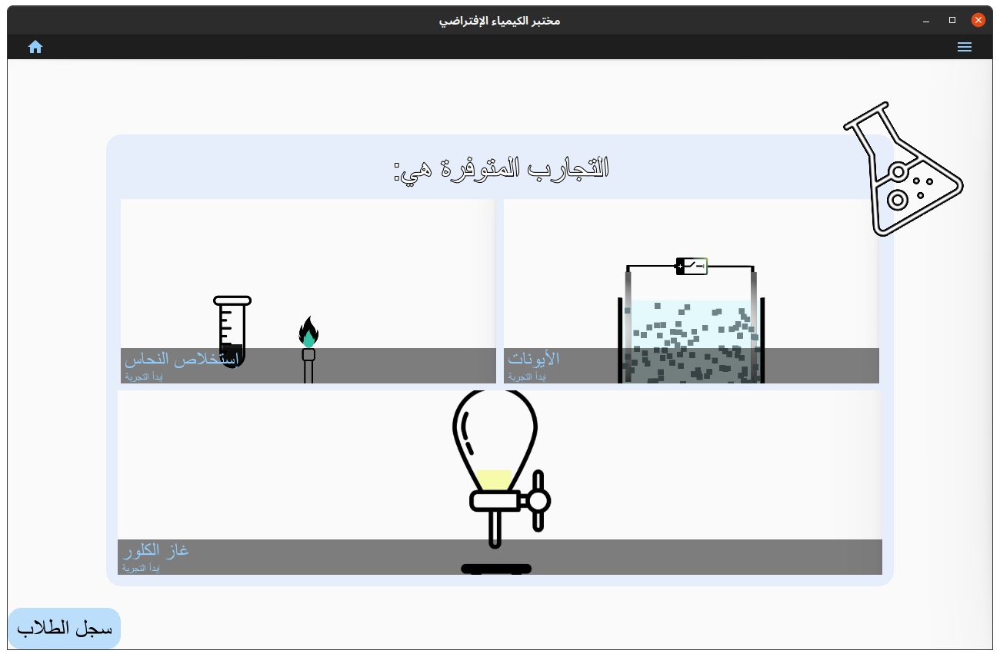
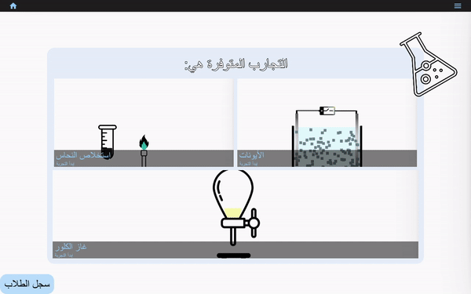

<!-- Improved compatibility of back to top link: See: https://github.com/othneildrew/Best-README-Template/pull/73 -->
<a name="readme-top"></a>


<!-- PROJECT LOGO -->
<br />
<div align="center">
  <a href="">
    
  </a>

<h3 align="center">مختبر الكيمياء الإفتراضي</h3>

  <p align="center">
    Prototype of a Kivy & KivyMD based GUI for aiding in chemsitry lab sessions
  </p>
</div>


<!-- TABLE OF CONTENTS -->
<details>
  <summary>Table of Contents</summary>
  <ol>
    <li>
      <a href="#about-the-project">About The Project</a>
    </li>
    <li>
      <a href="#getting-started">Getting Started</a>
    </li>
    <li><a href="#usage">Usage</a></li>
    <li><a href="#features">Features</a></li>
    <li><a href="#gallery">Gallery</a></li>
  </ol>
</details>


<!-- ABOUT THE PROJECT -->
## About The Project



Prototype to showcase what can be achieved with Kivy in the context of virtual labs and experiements. Initial developments were done in an Ubuntu 20.04 installation, but Kivy is cross platform so installations in windows or any other OS should be similar
<p align="right">(<a href="#readme-top">back to top</a>)</p>


<!-- GETTING STARTED -->
## Getting Started

Make sure you have Python 3 and pip installed. Clone this repository/download source code and run the following:
```bash
python3 -m pip install -r requirements.txt
````

<p align="right">(<a href="#readme-top">back to top</a>)</p>


<!-- USAGE EXAMPLES -->
## Usage

Run ```MainApp.py``` using python after everything is installed and the GUI should be up and running.

<p align="right">(<a href="#readme-top">back to top</a>)</p>

## Features
The applications contains **three** main experiments that each represent a different year in a traditional high-school system.

The three experiments are:
- Copper Extraction
- Ions
- Chlorine Gas

The application also allows for the student to submit a basic report contianting the student's name, academic year, and experiment currently attempted by them.
A teacher can access a table of all submitted reports from a dedicated button in the main menu. The table is shown in a widget that allows for scrolling.

<p align="right">(<a href="#readme-top">back to top</a>)</p>

## Gallery
The following are different sample animations showing the different functionality of the application:

- Copper Extraction Experiment



- Ions Experiment


- Chlorine Gas Experiment


- Student reports system


<p align="right">(<a href="#readme-top">back to top</a>)</p>
